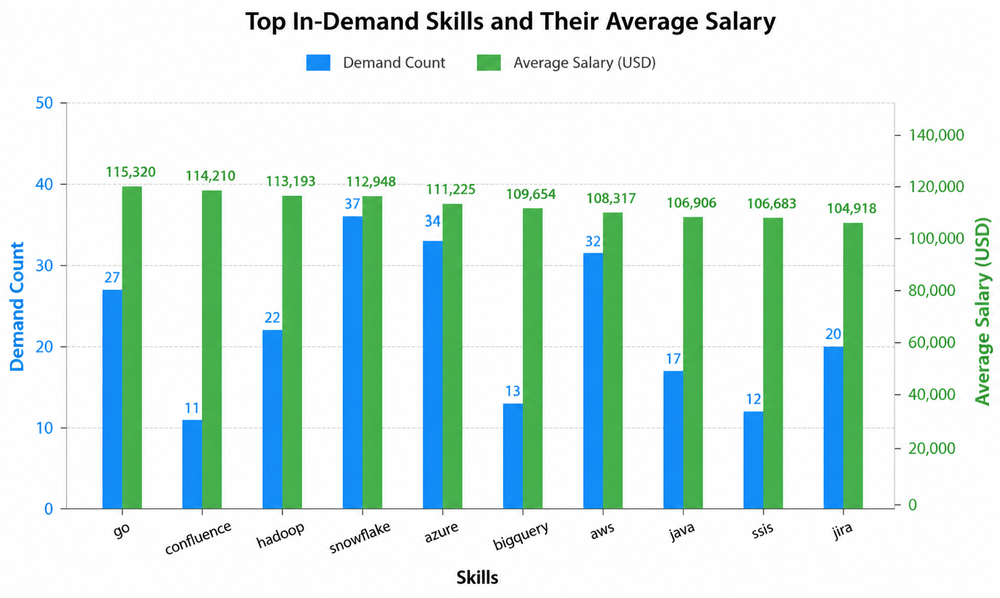

Update the contents

## Introduction

This project explores top-paying jobs,in demand skills and where high demand meets high salary in data analytics.

SQL Queries? Check them out here: [project_sql folder](/project_sql/)

## Background

This project helps us to find some important insights of the job analysis.

### The questions I wanted to answer through my SQL queries were:

1. What are the top -paying data analyst jobs?
2. What skills are required for the top-paying data analyst jobs?
3. What are the most in-demand skills for data analysts?
4. What are the top skills based on salary?
5. What are the most optimal skills to learn?

## Tools I Used

For my deep dive into the data analyst job market, I have used several tools:

- **SQL** : The backbone of my analysis,allowing me to query the database and unearth critical insights.
- **PostgresSQL** : The chosen database management system, ideal for handling the job posting data.
- **Visual studio code**: My go-to for database management and excecuting SQl queries.
- **Git and Github** : Essential for version control and sharing my work with others

## The Analysis

Each query for this project aimed at investigating specific aspects of the dats analyst job market.

### 1. Top Paying Data Analyst Jobs

To identify highest paying data analyst roles, I filtered data analayst positions by average yearly salary and location, focusing on remote jobs. This query highlights the high paying opportunities in the filed.

```sql
SELECT
    job_id,
    job_title,
    job_location,
    job_schedule_type,
    salary_year_avg,
    company_info.name
FROM
   job_postings_fact
LEFT JOIN company_dim AS company_info ON job_postings_fact.company_id = company_info.company_id
WHERE job_title_short = 'Data Analyst' AND
    job_location = 'Anywhere' AND
    salary_year_avg IS NOT NULL
ORDER BY
    salary_year_avg DESC
LIMIT 10
```

Salary Drivers for Top-Paying Data Analyst Roles

- Senior Data Analyst
- Analytics Consultant
- Product Analyst
- Business Intelligence Analyst
- Data Analytics Manager
- Marketing Analytics Lead

### 2. Skills for Top Paying Data Analyst Jobs

To understand what skills are required to for the top-paying jobs, I joined the job posting with skills data,provides a detailed look at which high- paying jobs demand certain skills, helping job seekers understand which skills to develop that align with top salaries.

```sql
WITH top_paying_jobs AS (
    SELECT
        job_id,
        job_title,
        job_location,
        job_schedule_type,
        salary_year_avg,
        company_info.name AS company_name
    FROM
    job_postings_fact
    LEFT JOIN company_dim AS company_info ON job_postings_fact.company_id = company_info.company_id
    WHERE job_title_short = 'Data Analyst' AND
        job_location = 'Anywhere' AND
        salary_year_avg IS NOT NULL
    ORDER BY
        salary_year_avg DESC
    LIMIT 10
)

SELECT
     top_paying_jobs.*,
     skills
FROM top_paying_jobs
INNER JOIN skills_job_dim ON top_paying_jobs.job_id = skills_job_dim.job_id
INNER JOIN skills_dim ON skills_job_dim.skill_id = skills_dim.skill_id
ORDER BY
      salary_year_avg DESC;

```


\_Here's a simple visual representation of the insights from the Top 10 Highest-Paying skills in Data Analyst Jobs;ChatGPT generated this from my sql query results.

### 3. Demanded skills for Top Paying Data Analyst Jobs

Retrives the top 5 skills with the highest demand in the job market,
providing insights into the most valuable skills for job seekers.

```sql
SELECT
   skills,
   COUNT(skills_job_dim.job_id) AS demand_count
FROM
   job_postings_fact
INNER JOIN skills_job_dim ON job_postings_fact.job_id = skills_job_dim.job_id
INNER JOIN skills_dim ON skills_job_dim.skill_id = skills_dim.skill_id
WHERE
  job_title_short = 'Data Analyst' AND job_work_from_home = TRUE
GROUP BY
   skills
ORDER BY
  demand_count DESC
LIMIT 5
```

| Rank | Skill    | Demand Count |
| ---- | -------- | -----------: |
| 1    | SQL      |        7,291 |
| 2    | Excel    |        4,611 |
| 3    | Python   |        4,330 |
| 4    | Tableau  |        3,745 |
| 5    | Power BI |        2,609 |

### 4. Top paying skills based on the average salary of Data Analyst Jobs

It reveals how different skills impact salary levels for data analysts and helps
identify the most financially rewarding skills to acquire or improve

```sql
SELECT
     skills,
     ROUND(AVG(salary_year_avg), 0) AS avg_salary
FROM
   job_postings_fact
INNER JOIN skills_job_dim ON job_postings_fact.job_id = skills_job_dim.job_id
INNER JOIN skills_dim ON skills_job_dim.skill_id = skills_dim.skill_id
WHERE
     job_title_short = 'Data Analyst' AND
     job_work_from_home = TRUE AND
     salary_year_avg IS NOT NULL
GROUP BY
     skills
ORDER BY
     avg_salary DESC
LIMIT 20
```

## Top-Paying Skills for Data Analysts

| Rank | Skill     | Average Salary (USD) |
| ---- | --------- | -------------------: |
| 1    | PySpark   |             $208,172 |
| 2    | Bitbucket |             $189,155 |
| 3    | Couchbase |             $160,515 |
| 4    | Watson    |             $160,515 |
| 5    | DataRobot |             $155,486 |

### 5. Most optimal skills : What are the most optimal skills to learn? Optimal : high demand AND high paying

This query filtered out the data with high demand skills with average high paying salary jobs

```sql

WITH demand_skills AS (
    SELECT
        skills_dim.skill_id,
        skills_dim.skills,
        COUNT(skills_job_dim.job_id) AS demand_count
    FROM
        job_postings_fact
    INNER JOIN skills_job_dim ON job_postings_fact.job_id = skills_job_dim.job_id
    INNER JOIN skills_dim ON skills_job_dim.skill_id = skills_dim.skill_id
    WHERE
        job_title_short = 'Data Analyst' AND
        job_work_from_home = TRUE AND
        salary_year_avg IS NOT NULL
    GROUP BY
        skills_dim.skill_id
), average_salary AS (
    SELECT
        skills_job_dim.skill_id,
        ROUND(AVG(salary_year_avg), 0) AS avg_salary
    FROM
        job_postings_fact
    INNER JOIN skills_job_dim ON job_postings_fact.job_id = skills_job_dim.job_id
    INNER JOIN skills_dim ON skills_job_dim.skill_id = skills_dim.skill_id
    WHERE
        job_title_short = 'Data Analyst' AND
        job_work_from_home = TRUE AND
        salary_year_avg IS NOT NULL
    GROUP BY
        skills_job_dim.skill_id
)

SELECT
    demand_skills.skill_id,
    demand_skills.skills,
    demand_count,
    avg_salary
FROM demand_skills
INNER JOIN average_salary ON demand_skills.skill_id = average_salary.skill_id
WHERE demand_count >10
ORDER BY
    avg_salary DESC,
    demand_count DESC

```


_Bar graph visualizing the slary for the top 10 salaries for data analysts; ChatGPT genereted this graph from my sql query results table_

## What I Learned

- I have learned complex query structure, how Common Table Expression (CTE) can be used as a temporary results sets for different queries.
- I have also learned about GROUP BY and ORDER BY clause.How we can show the result from high to low or low to high. Moreover, how GROUP BY is used with aggregation function which gives thorough insights.
- Leveled up my real-world problem solving skills,turning questions into results with visual representation.

## Conclusions

### Closing thoughts

This project enhanced my SQL skills and provided valuable insights into the data analyst jobs market.The findings from the analysis serve as a guide to prioritizing skill development and job search efforts.
